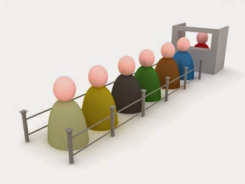

# Queue

Queue is an abstract data type or a linear data structure, just like stack data structure, in which the first element is inserted from one end called the REAR(also called tail), and the removal of existing element takes place from the other end called as FRONT(also called head).

A real-world example of queue can be the ticket queue outside a cinema hall, where the first person entering the queue is the first person who gets the ticket.

 Queue follows **First-In-First-Out(FIFO)** methodology, i.e., the data item stored first will be accessed first.

## Basic Operations of Queue

Queue operations may involve initializing or defining the queue, utilizing it, and then completely erasing it from the memory. Here we shall try to understand the basic operations associated with queues :

`enqueue()` - add (store) an item to the queue.

`dequeue()` − remove (access) an item from the queue.

Few more functions are required to make the above-mentioned queue operation efficient. These are :

`peek()` − Gets the element at the front of the queue without removing it.

`isfull()` − Checks if the queue is full.

`isempty()` − Checks if the queue is empty.

## Types of Queue

* [**Linear Queue**](#linear-queue)
* [**Circular Queue**](#circular-queue)
* [**Priority Queue**](#priority-Queue)
