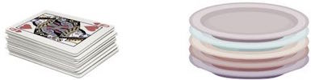

# Stack

A stack is an Abstract Data Type (ADT), commonly used in most programming languages. It is named stack as it behaves like a real-world stack, _for example_ – a deck of cards or a pile of plates, etc.

A real-world stack allows operations at one end only. For example, we can place or remove a card or plate from the top of the stack only. Likewise, Stack ADT allows all data operations at one end only. At any given time, we can only access the top element of a stack.

This feature makes it **LIFO** data structure. LIFO stands for Last-in-first-out. Here, the element which is placed (inserted or added) last, is accessed first. In stack terminology, insertion operation is called PUSH operation and removal operation is called POP operation.

## Stack Representation

#### The following diagram depicts a stack and its operations −

A stack can be implemented by means of Array, Structure, Pointer, and Linked List. Stack can either be a fixed size one or it may have a sense of dynamic resizing. In this folder, I have made stack using arrays, structure and linkedlist.
