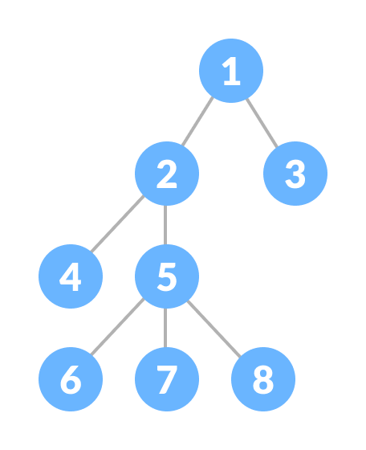

# Trees

A tree is a nonlinear hierarchical data structure that consists of nodes connected by edges.

Other data structures such as arrays, linked list, stack, and queue are linear data structures that store data sequentially. In order to perform any operation in a linear data structure, the time complexity increases with the increase in the data size.

Different tree data structures allow quicker and easier access to the data as it is a non-linear data structure.